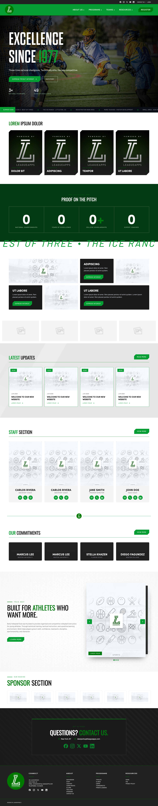
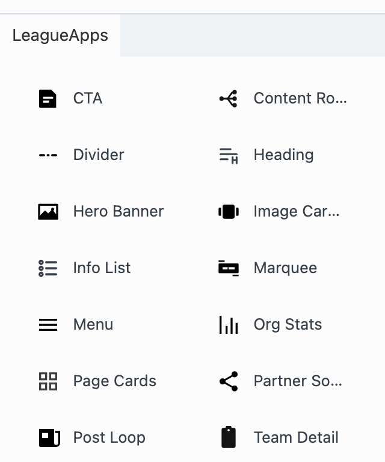
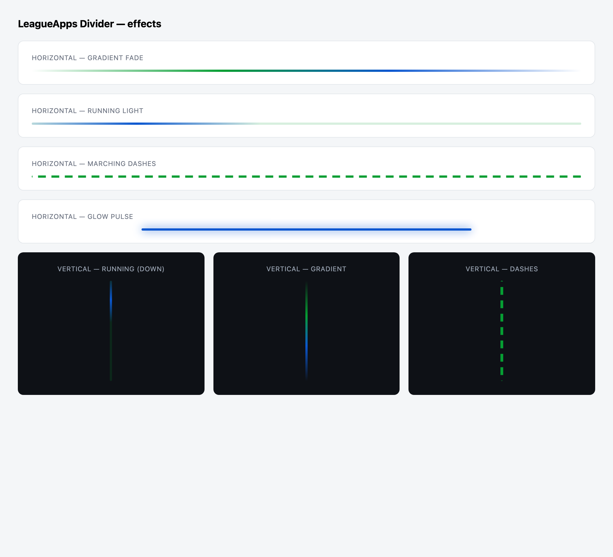

# DS Launchpad — What's New (staging preview)

*Prepared 2026-06-22. Status: **in staging**, not yet released.*

## The big picture

The DS Launchpad now ships its **own set of drag-and-drop building blocks** inside the
website builder, grouped under a single **"LeagueApps"** menu. Instead of leaning on
third-party add-ons, every partner site is now assembled from in-house, on-brand blocks
that the Design Shop owns end to end.

This is the heart of turning the Launchpad into a repeatable **product**: each new partner
site is built from the same branded, reusable pieces, faster and more consistently.

*Above: a complete partner site (hero, navigation, stats, news, staff, calls-to-action,
sponsors) assembled entirely from LeagueApps blocks.*

## The building blocks (LeagueApps modules)

All of these now live under one **"LeagueApps"** group in the builder:

| Block | What it does |
|---|---|
| **Hero Banner** | Big top-of-page banner (image, video, or slideshow) |
| **Menu** | Site navigation, including mega-menus |
| **Post Loop** | Lists of news, staff, teams, programs, sponsors, tournaments |
| **Page Cards** | Grid of linked cards |
| **Image Carousel** | Stacked image slider |
| **Org Stats** | Headline numbers and the record |
| **Marquee** | Scrolling announcement ticker |
| **Info List** | Icon-and-text lists |
| **CTA** | Call-to-action band |
| **Heading** | Styled section headings |
| **Divider** | Decorative section dividers *(new this update)* |
| **Team Detail** | Single-team roster and schedule layout |
| **Content Router** | Shows the right layout for each page type |
| **Partner Social** | Social links row |

## Newest additions (this update)

- **Divider block:** horizontal or vertical dividers with effects, including a gradient
  fade, a "loading" light that runs along the line, a glow pulse, and marching dashes.
- **Hero "Multiple Backgrounds":** layer colours, gradients, and images behind the hero.
- **Smarter Menu mega-menus:** pick which menu items open as mega-menus with a simple
  search-and-click picker, set the number of columns, and style the panels.
- **Simpler Post Loop for partners:** program and sponsor lists now live on one
  **Content** tab, and the technical **Query** tab is hidden when it isn't needed.

## Why it matters

- **Faster builds.** Partner sites snap together from ready-made, branded blocks.
- **Consistent and on-brand.** Every block automatically pulls the site's global colours
  and fonts.
- **Owned in-house.** No third-party module fees or lock-in. The Design Shop controls
  every block.
- **Easier for non-developers.** Everything is point-and-click in the builder.

## Status

This is in **staging** for review. **Nothing is live yet.**
The full technical change list is in [CHANGELOG.md](../CHANGELOG.md).
